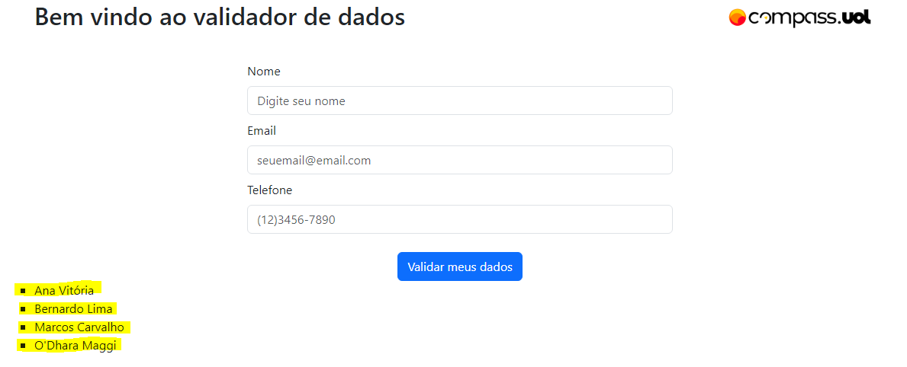

# Avaliação Sprint 2 - Programa de Bolsas Compass UOL / AWS e Univesp

Avaliação da segunda sprint do programa de bolsas Compass UOL para formação em machine learning para AWS.

***

## Objetivo

Este guia irá orientá-lo na criação de uma Virtual Private Cloud (VPC) na plataforma de nuvem da Amazon (AWS) para a exposição de sites e projetos na web.

## Pré-requisitos

Antes de começar, é necessário ter uma conta da AWS e acesso ao console da AWS. 
É importante também estar familiarizado com os conceitos básicos de redes e segurança.

## Execução (Código Fonte)

#### Passo 1 - Criando uma VPC

1. Abra o Console da AWS e navegue até o serviço de VPC.
2. Clique em "Criar VPC" e defina o nome da sua VPC, juntamente com o bloco de endereço de IP e configurações do DNS.
3. Após isso, clique em "Criar" e aguarde a confirmação.
4. Para que seja possível dividir o bloco de endereço de IP utilizado na criação da VPC, vá até a opção de "Subnets", localizado no menu lateral esquerdo, e crie quatro Subnets:
- Duas Subnets Privadas vinculadas a VPC criada, sendo: cada uma em zona de disponibilidade diferente da outra e com seu respectivo bloco de IP;
- Duas Subnets Públicas vinculadas a VPC criada, sendo: cada uma em zona de disponibilidade diferente da outra e com seu respectivo bloco de IP.
5. Configure as Subnets Públicas selecionando em "Ações", "Editar configurações de sub-rede" e vincule a opção "Habilitar endereço IPv4 público de atribuição automática". Essa configuração deve ser feita apenas nas Subnets Públicas.


#### Passo 2 - Criando um Internet Gateway e associando à VPC

1. No console da VPC, selecione "Internet Gateways" no painel de navegação à esquerda.
2. Clique em "Criar Internet Gateway" e defina um nome para o seu gateway.
3. Selecione o gateway recém-criado e clique em "Associar com VPC".
4. Selecione a VPC que você criou anteriormente e confirme a associação.

#### Passo 3 - Criando rotas públicas e privadas

1. No console da VPC, selecione "Rotas" no painel de navegação à esquerda.
2. Clique em "Criar rota" e defina a tabela de rota que deseja atualizar.
3. Adicione uma nova rota para a rede pública, com o bloco de endereço IP 0.0.0.0/0 e selecione o Internet Gateway que você criou anteriormente como destino.
4. Adicione uma nova rota para a rede privada.

#### Passo 4 - Criando um NAT Gateway

1. No console da VPC, selecione "NAT Gateways" no painel de navegação à esquerda.
2. Clique em "Criar NAT Gateway" e defina a VPC e a sub-rede pública onde o NAT Gateway será criado.
3. Selecione um Elastic IP que será associado ao NAT Gateway e aguarde a confirmação da criação.

#### Passo 5 - Concluir a configuração da rota privada
1. Retorne em "Tabela de Rotas", selecione a rota privada criada e configure-a com o bloco de endereço IP 0.0.0.0/0 e selecione o NAT Gateway como destino.


#### Passo 6 - Criar ou editar o Security Group com as regras entrada e saída
1. No console da VPC, selecione "Grupos de Segurança".
2. Crie um grupo de segurança público e vincule as seguintes configurações:
- Regra de entrada: libere o acesso "SSH" ao seu próprio endereço de IP.
- Regra de saída: libere todo o tráfego ao endereço 0.0.0.0/0.

#### Passo 7 - Criar uma instância t2.micro.
No painel EC2, selecione executar instância:
1. Escolha os nomes e tags
2. Determine o sistema operacional
3. No campo "Tipo de instância" faça a escolha da opção "t2.micro"
4. Insira ou crie par de chaves
5. Edite a "Configurações de rede" a partir da VPC criada anteriormente e conforme a intenção de criação, escolha as subnets para instância, atribua ou não IP público automaticamente. No grupo de segurança escolha ou crie, isso dependerá do seu objetivo para a instância.
6. Na "configuração de armazenamento" opte pela quantidade e tipo de volume que sua instância irá ter.
7. Finalize executando a instância, e aguarde a sua execução e disponibilidade.

#### Passo 8 - Instalar um servidor nginx na instância.
Após configurar as maquinas criadas, para que possa ter acesso a internet.
Realize os comandos no terminal:
- sudo su –
- yum update -y
- sudo amazon-linux-extras install nginx1
- systemctl enable nginx –-now
Após os comandos acima, a máquina estará pronta para upar sua aplicação na pasta destinada para root do nginx.

#### Passo 9 - Trocar ou acrescentar a porta 9000 para acesso através do nginx.
Com a aplicação na pasta em que root do nginx está direcionado. É necessário configurar “Elastic Load Balancer” no console.
Acesse o painel EC2 e vá em “Balanceamento de carga”, na configuração:
- Escolha o esquema que sua aplicação é voltada.
- No campo “Listeners” realize a escolha das portas, no caso a porta HTTP 9000
- Zona de disponibilidade, selecione as subnets criadas anteriormente.
- Por uma melhor conduta, crie um grupo de segurança voltado para regras de entrada para porta 9000
- Na configuração roteamento selecione a porta 9000
- Registre o destino conforme a instância que se encontra aplicação que queria upar na web.
- Confirme suas configurações, caso esteja preenchido corretamente. Será criado Elastic Load Balancer


### Passo 10 - Subir ao servidor a aplicação da Sprint 1.
Nossa aplicação ficará armazenada num servidor privado, o qual só poderá ser acessado através da nossa instância Bastion Host. Portanto, para subir nossa aplicação, deveremos primeiro zipar o conteúdo e relizar uma cópia da nossa máquina local para a instância _bastion_.
Os seguintes comandos foram realizados utilizando o terminal do windows, aberto no mesmo diretório que a chave SSH:

Acessando o bastion host:
```sh
	ssh -i minhaChave.pem ec2-user@54.165.101.229
```

Fazendo cópia da chave SSH para o bastion host:
```sh
	scp -i minhaChave.pem minhaChave.pem ec2-user@54.165.101.229:/tmp/
```

Copiar conteúdo zipado para o bastion host:
```sh
	scp -i minhaChave.pem sprint_1.zip ec2-user@54.165.101.229:/tmp/
```

***

Neste ponto, temos nossa chave privada no bastion host assim como o conteúdo da aplicação lozalizados no diretório tmp.
Precisamos agora enviar nossa aplicação para o webserver:

Copiando o conteúdo zipado do bastion para o server:
```sh
  scp -i minhaChave.pem ../sprint_1.zip ec2-user@10.0.2.219:/tmp/
```

O nginx por padrão aponta para o ditretório ``/usr/share/nginx/html``. Vamos alterar esse apontamento:

Alteranto pasta root do nginx:
```sh
  cd etc/nginx
  vim nginx.config
```

Modificar a seguinte linha:
```sh
  #root    	/usr/share/nginx/html
  root    	/var/www/html
```

Verificando integridade do arquivo `nginf.conf`:
```sh
	nginx -t
```

Vamos criar o diretório `/var/www/html`:
```sh
  cd /var/
  mkdir www/html -p
```

Movendo nosso conteúdo .zip para este diretório recém criado:
```sh
  mv tmp/sprint_1.zip www/html
```

Descompactando:
```sh
  unzip sprint_1.zip
```

Disponibilizando o conteúdo na raíz do diretório:
```sh
  mv sprint_1-pb-aws-univesp/* .
```

E por fim verificando se a aplicação está online, esperamos ver no terminal a estrutura do nosso HTML:
```sh
  curl -X GET htpp://10.0.2.219
```


### Passo 11 - Na página html disponibilizada com o código da Sprint 1, colocar a identificação do grupo e os nomes dos componenentes.
Na estrutura do HTML desenvolvido durante a sprint 1, foi adicionado o nome dos integrantes do grupo da sprint 2, como segue na imagem abaixo:




### Passo 12 - Permitir o acesso da porta 9000 à pasta com a aplicação, para visualização da página de forma online.
Na criação do grupo de segurança do Load Balancer, devemos adicionar uma regra TCP Personalizada para permitir acesso de qualquer lugar pela porta 9000, caso contrário, o acesso ocorrerá apenas pelas portas padrões 80: HTTP e 443: HTTPS. Isso fará com que um usuário possa acessar nossa aplicação adicionando um `:9000` ao final da URL.
Esta técnica serve para casos específicos onde algumas aplicações só podem ser acessadas através de portas específicas, como no caso de API's.

Adicionar um grupo de segurança existente ou clicar em "criar novo grupo de segurança".


Adicionar Uma rega TCP Personalizado com a porta de acesso 9000.
Clicar em salvar.


Finzalizada essas duas etapas, nossa aplicação deverá estar acessível através do DNS do Load Balancer

***

## Conclusão
Após a realização destas 10 etapas, a arquiterura do nosso ambiente deverá estar como na imagem abaixo.
O cliente não tem acesso direto à máquina onde estará armazenado o conteúdo da nossa aplicação, todo o tráfego deverá passar pela nossa instância de Bastion Host, o qual tem permissão dentro da VPC para acesso a subnet privada.

