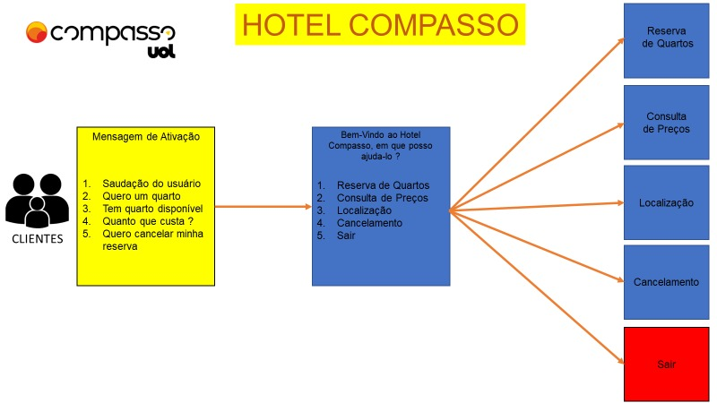
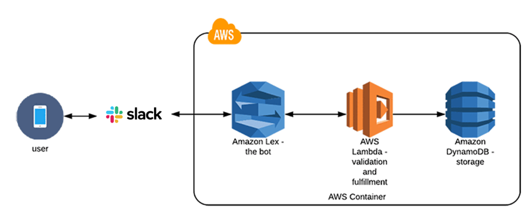
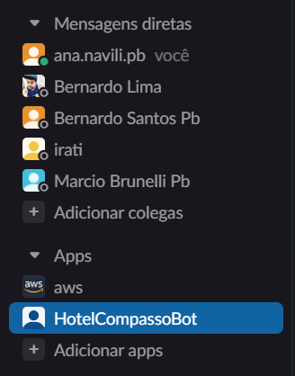
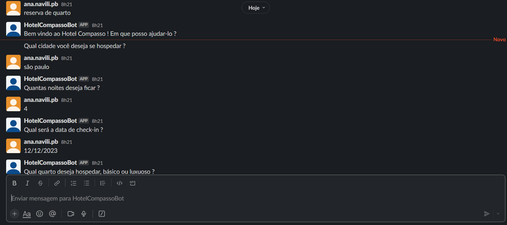

# Avaliação Sprint 7 - Programa de Bolsas Compass UOL / AWS e Univesp

Avaliação da sétima sprint do programa de bolsas Compass UOL para formação em machine learning para AWS.

***

## O Projeto

Este projeto tem como objetivo criar um chatbot utilizando o Amazon Lex v2 e integrá-lo ao Slack. 
- O Amazon Lex é um serviço de chatbot de conversação que usa a tecnologia de processamento de linguagem natural (NLP) para compreender a intenção do usuário e responder de acordo. 
- O Slack é uma plataforma de comunicação empresarial que permite aos usuários trocar mensagens em tempo real e colaborar em projetos.

O chatbot desenvolvido tem como principal funcionalidade agilizar o processo de hospedagem em hotel. Ele é projetado para interagir com os usuários, oferecendo respostas rápidas e precisas às suas perguntas e solicitações relacionadas à hospedagem podendo lidar com diversas tarefas, como:
- fazer reservas de quartos;
- verificar a disponibilidade de quartos em datas específicas;
- realizar o cancelamento de hospedagem;
- informar tabela com preços.

  
  
    
Funcionalidades do Bot

  

***

## Desenvolvimento

**Configurando o chatbot**

A criação de um chatbot utilizando o Amazon Lex v2 envolve os seguintes passos principais:

  1. Definição do bot: No Console do Amazon Lex v2, você pode criar um novo bot e definir suas características principais.

  2. Design do fluxo de conversação: Em seguida, você precisa projetar o fluxo de conversação do seu chatbot (intents e respostas).

  3. Criação de slots: Para coletar informações específicas dos usuários, você pode definir slots.

  4. Implantação do bot: Após a configuração do chatbot, você pode implantá-lo e testá-lo no ambiente de desenvolvimento.

  5. Publicação e integração: Quando o chatbot estiver funcionando corretamente, você pode publicá-lo para que ele esteja acessível ao público.

  
  
    
Servicos utlizados

  

**Configurando o Slack**

Para realizar a integração do chatbot ao Slack, foi utilizado o seguintes passos:

  1. Crie um aplicativo no Slack, se ainda não tiver um. Para isso, acesse a página de criação de aplicativos do Slack e siga as instruções.

  2. Depois de criar o aplicativo, é necessário configurar o bot para se comunicar com o Amazon Lex v2. Para isso, adicione a URL de chamada do Amazon Lex v2 na seção "Interação" do aplicativo do Slack.

  3. Em seguida, crie um webhook para enviar as mensagens do Slack para o bot. O webhook é uma URL que o Slack usará para enviar mensagens ao bot. Para criar o webhook, vá para a seção "Eventos" do aplicativo do Slack e adicione a URL do webhook na seção "Assinatura de solicitação de eventos".

  4. Depois de criar o webhook, é necessário configurar o bot para ouvir as mensagens enviadas pelo Slack. Para fazer isso, adicione um gatilho no Amazon Lex v2. O gatilho é uma URL que o Amazon Lex v2 usará para receber mensagens do Slack.
 
***

## Testando a integração
- Depois de configurar o bot no Amazon Lex v2 e integrá-lo ao Slack, você pode testar a integração enviando mensagens para o bot [neste link](https://join.slack.com/t/compassochatb-iqn9904/shared_invite/zt-1uxxpx71z-loExX6AF53AVCVHPrMWx1w). As mensagens serão enviadas para o Amazon Lex v2, que irá processá-las e responder de acordo.

  
  
    
Acessando o bot na plataforma Slack

  

Um exemplo de interação pode ser conferido nesta imagem abaixo:

  

    
    
      
Exemplo de atendimento

    
  

***

## Conclusão e Dificuldades
- Realizar a criação e integração de um chatbot Amazon Lex v2 com Slack é uma tarefa relativamente simples, mas que requer um pouco de configuração. Ao seguir os passos descritos acima, é possível criar um bot eficiente e integrá-lo a uma plataforma de comunicação empresarial popular, permitindo que os usuários se comuniquem com o bot de maneira fácil e rápida.

***

## Desenvolvedores do projeto

| [ Ana Vitória Louro Navili](https://github.com/anaVitoriaLouro) | [ Bernardo Lima](https://github.com/belima93)| [ Irati Gonçalves Maffra](https://github.com/IratiMaffra) | [ Marcio Lima Brunelli](https://github.com/ml-brunelli) |
| :---: | :---: | :---: |:---: |

***

## Referências
- Amazon Lex - [Documentação Amazon Lex](https://compasso-my.sharepoint.com/:f:/g/personal/lucas_sousa_compasso_com_br/Eph8d9BDeRhGhBzyoAYRLZUBhfjA54P1-5YHERGaN5_Osg?e=1ibFDI);
- Slack - [Conexão Slack](https://docs.aws.amazon.com/pt_br/lex/latest/dg/slack-bot-association.html)  
